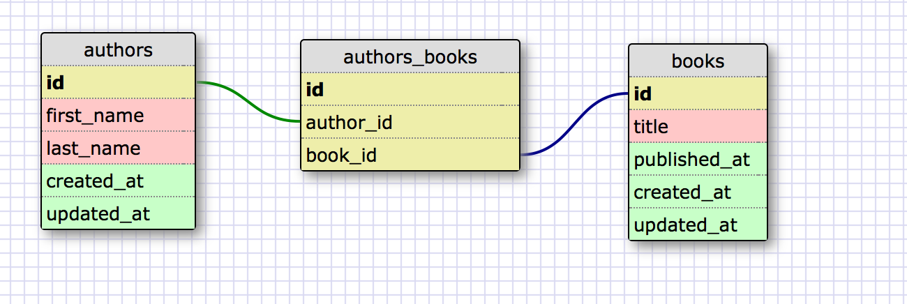

# U3.W7: Designing Schemas

#### I worked on this challenge [by myself]

## Release 0: Student Roster Schema
<!-- display your image inline here -->

## Release 1: One to Many Schema
<!-- display your image inline here -->

## Release 2: One to One Schema
<!-- display your image inline here -->

## Release 3: Many to Many Schema
<!-- display your image inline here -->

## Release 4: Design your own Schema
Description of what you're modeling: 

<!-- display your one-to-one image inline here -->

<!-- display your many-to-many image inline here -->

## Release 5: Reflection

I've worked with databases before, and designed some simple databases, but I don't
remember learning about the different patterns. I'm curious about how the relationship
between primary and foriegn keys affects database queries.
