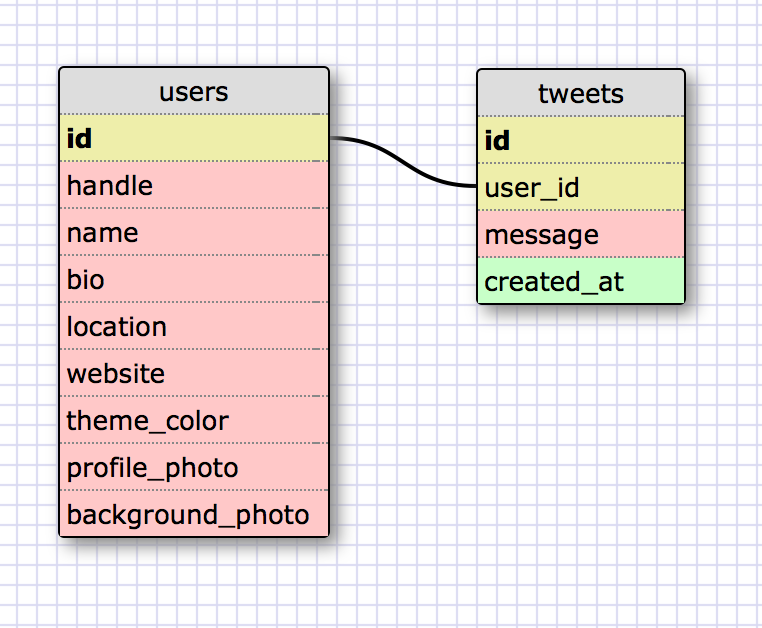

# U3.W7: Modeling a Real-World Database (SOLO CHALLENGE)

## Release 0: Users Fields
<!-- Identify the fields Twitter collects data for -->
twitter handle
name
bio
location
website
theme color
profile photo
background photo

## Release 1: Tweet Fields
<!-- Identify the fields Twitter uses to represent/display a tweet. What are you required or allowed to enter? -->
can only enter the text of the tweet
timestamp
it also tracks how many times the tweet has been retweeted and favorited

## Release 2: Explain the relationship
The relationship between `users` and `tweets` is: 
<!-- because... -->
The relationship is one to many because each user can have many tweets

## Release 3: Schema Design
<!-- Include your image (inline) of your schema -->

## Release 4: SQL Statements
<!-- Include your SQL Statements. How can you make markdown files show blocks of code? -->
SELECT message FROM tweets WHERE user_id = 1234

SELECT messeage FROM tweets WHERE user_id = 1234 AND created_at > 2014-05-07

SELECT message FROM users JOIN tweets ON (users.id = tweets.user_id) WHERE handle = "@XENI"

SELECT handle FROM users JOIN tweets ON (users.id = tweets.user_id) WHERE tweets.id = 123

## Release 5: Reflection
<!-- Be sure to add your reflection here!!! -->
This is the first solo challenge where I feel insecure about my solutions because I can't check whether my SQL statements are working or not. In particular, I'm not sure about the last two select statements that are joining the two different tables, and how exactly the select statements deal with dates.